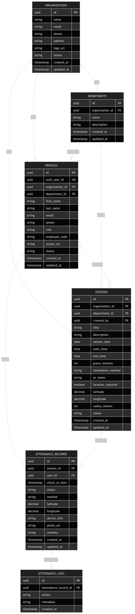

# Entity Relationship Diagram (ERD)

## Table of Contents
1. [Purpose](#1-purpose)
2. [Main Entities](#2-main-entities)
3. [ER Diagram](#3-er-diagram)
4. [Entity Definitions](#4-entity-definitions)
5. [Relationship Summary](#5-relationship-summary)
6. [Important Constraints](#6-important-constraints)
7. [Recommended Enum Values](#7-recommended-enum-values)
8. [Supabase Note](#8-supabase-note)
9. [Optional Future Entities](#9-optional-future-entities)

---

## 1. Purpose
This ER Diagram defines the main data entities in the Smart Attendance Tracking System, their attributes, and the relationships between them. It serves as the foundation for database implementation in Supabase PostgreSQL.

## 2. Main Entities
The core entities are:
* **organizations**
* **departments**
* **profiles**
* **sessions**
* **attendance_records**
* **attendance_logs**

*Note: Authentication users already exist in `auth.users` within Supabase Auth.*

## 3. ER Diagram

## 4. Entity Definitions

### 4.1. Organizations
Represents companies, schools, or institutions using the platform.
* **Attributes:** `id`, `name`, `email`, `phone`, `address`, `logo_url`, `status`.

### 4.2. Departments
Represents departments, classes, or groups within an organization.
* **Attributes:** `id`, `organization_id`, `name`, `description`.

### 4.3. Profiles
Represents application users, linking to Supabase Auth.
* **Attributes:** `id`, `auth_user_id`, `organization_id`, `department_id`, `first_name`, `last_name`, `email`, `phone`, `role`, `employee_code`, `avatar_url`, `status`.
* **Roles:** `super_admin`, `organization_admin`, `attendee`.

### 4.4. Sessions
Represents attendance events created by admins.
* **Attributes:** `id`, `organization_id`, `department_id`, `created_by`, `title`, `description`, `session_date`, `start_time`, `end_time`, `grace_minutes`, `attendance_method`, `qr_token`, `location_required`, `latitude`, `longitude`, `radius_meters`, `status`.

### 4.5. Attendance Records
Represents a user’s attendance entry for a session.
* **Attributes:** `id`, `session_id`, `user_id`, `check_in_time`, `status`, `method`, `latitude`, `longitude`, `device_info`, `photo_url`, `remarks`.

### 4.6. Attendance Logs
Represents audit history for attendance actions.
* **Attributes:** `id`, `attendance_record_id`, `action`, `metadata`, `created_at`.

## 5. Relationship Summary
| Parent Entity | Child Entity | Relationship |
| :--- | :--- | :--- |
| Organizations | Departments | One-to-Many |
| Organizations | Profiles | One-to-Many |
| Organizations | Sessions | One-to-Many |
| Departments | Profiles | One-to-Many |
| Departments | Sessions | One-to-Many |
| Profiles | Sessions | One-to-Many |
| Profiles | Attendance Records | One-to-Many |
| Sessions | Attendance Records | One-to-Many |
| Attendance Records | Attendance Logs | One-to-Many |

## 6. Important Constraints
* **Profiles:** `auth_user_id` and `email` must be unique.
* **Sessions:** `end_time > start_time`, `grace_minutes >= 0`, `qr_token` unique.
* **Attendance Records:** Unique constraint on `(session_id, user_id)` to prevent duplicates.

## 7. Recommended Enum Values
* **Role:** `super_admin`, `organization_admin`, `attendee`.
* **Session Status:** `draft`, `active`, `closed`, `cancelled`.
* **Attendance Status:** `present`, `late`, `absent`, `excused`.

## 8. Supabase Note
Real auth identity lives in `auth.users`. `profiles.auth_user_id` references that auth user.

## 9. Optional Future Entities
* `notifications`, `session_participants`, `devices`, `attendance_disputes`.
